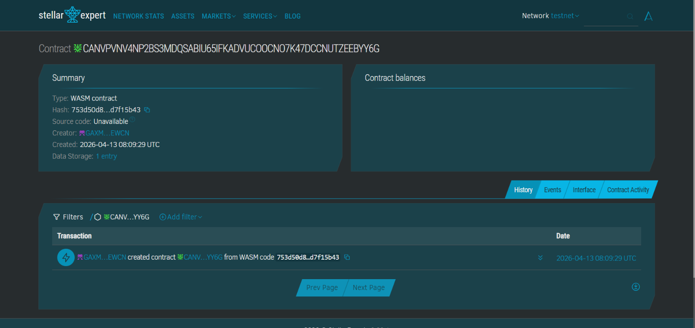

# 🛡️ Counterfeit Detection Smart Contract (Soroban - Stellar)


A decentralized solution to detect counterfeit products using blockchain technology. This project leverages **Soroban smart contracts on the Stellar network** to create a tamper-proof system for product verification.


## 📌 Project Overview

Counterfeit products are a growing issue in industries like pharmaceuticals, electronics, fashion, and luxury goods. Traditional verification systems are often centralized and vulnerable to manipulation.

This project introduces a **blockchain-based counterfeit detection system**, where each product is assigned a unique ID and stored on-chain. Users can verify the authenticity of a product instantly using this ID.


## 🎯 Problem Statement

* Fake products harm consumers and brands
* Centralized databases can be tampered with
* Lack of transparency in supply chains
* Difficult for users to verify product authenticity

## 💡 Solution

We use **Soroban smart contracts** to:

* Store product data immutably on the Stellar blockchain
* Provide instant verification using product IDs
* Prevent duplicate registrations
* Enable trust without intermediaries

## ⚙️ How It Works

1. **Manufacturer Registration**

   * A manufacturer registers a product using a unique `product_id`
   * Metadata (e.g., product name, origin, batch) is stored on-chain

2. **Blockchain Storage**

   * Data is stored in Soroban contract storage (immutable & secure)

3. **Verification**

   * Users input or scan a product ID
   * The contract checks if it exists
   * Returns authenticity status

## 🧠 Smart Contract Functions

### 1. `register_product(product_id, metadata)`

Registers a new product on the blockchain.

* Prevents duplicate entries
* Stores metadata securely

### 2. `verify_product(product_id)`

Checks whether a product exists.

* Returns: `true` → Genuine
* Returns: `false` → Possibly counterfeit


### 3. `get_product(product_id)`

Fetches product metadata.

* Returns detailed information about the product


## 🚀 Features

* 🔐 **Tamper-Proof Storage** – Data stored on blockchain cannot be altered
* ⚡ **Fast & Low Cost** – Powered by Stellar network
* 🧾 **Simple Verification** – Easy lookup using product ID
* ❌ **Duplicate Protection** – Prevents re-registration of same product
* 📦 **Metadata Support** – Store detailed product info
* 🌍 **Decentralized Trust** – No central authority required

## 🏗️ Tech Stack

* **Smart Contract:** Soroban
* **Language:** Rust
* **Blockchain:** Stellar
* **Storage:** On-chain contract storage


## 📂 Project Structure

```
counterfeit-detection/
│── src/
│   └── lib.rs          # Smart contract logic
│── Cargo.toml          # Rust dependencies
│── README.md           # Project documentation
```

## 🛠️ Setup & Installation

### Prerequisites

* Rust installed
* Soroban CLI installed
* Stellar account (testnet)

### Install Soroban CLI

```bash
cargo install soroban-cli
```


### Build Contract

```bash
cargo build --target wasm32-unknown-unknown --release
```


### Deploy to Stellar Testnet

```bash
soroban contract deploy \
  --wasm target/wasm32-unknown-unknown/release/your_contract.wasm \
  --source YOUR_ACCOUNT \
  --network testnet
```


## 🔗 Deployed Smart Contract

Smart Contract Address: CANVPVNV4NP2BS3MDQSABIU65IFKADVUCOOCNO7K47DCCNUTZEEBYY6G 

👉 https://stellar.expert/explorer/testnet/contract/CANVPVNV4NP2BS3MDQSABIU65IFKADVUCOOCNO7K47DCCNUTZEEBYY6G


## 🧪 Example Usage

### Register Product

```bash
soroban contract invoke \
  --id CONTRACT_ID \
  --fn register_product \
  --arg product_id="P123" \
  --arg metadata="Nike Shoes Batch 2026"
```

---

### Verify Product

```bash
soroban contract invoke \
  --id CONTRACT_ID \
  --fn verify_product \
  --arg product_id="P123"
```

---

### Get Product Details

```bash
soroban contract invoke \
  --id CONTRACT_ID \
  --fn get_product \
  --arg product_id="P123"
```

---

## 🔒 Security Considerations

* Ensure only authorized manufacturers can register products (future scope)
* Add digital signatures for authenticity
* Prevent spam registrations
* Validate metadata format

---

## 🌱 Future Enhancements

* 🔑 Manufacturer authentication system
* 📱 QR Code scanning for instant verification
* 🌐 Frontend web dashboard (React + Stellar SDK)
* 🔗 Supply chain tracking (ownership history)
* 📊 Analytics for counterfeit detection trends
* 🧠 AI-based anomaly detection

---

## 🤝 Contributing

Contributions are welcome!

1. Fork the repository
2. Create a new branch (`feature/your-feature`)
3. Commit your changes
4. Push to your branch
5. Open a Pull Request

---

## 📜 License

This project is licensed under the MIT License.

---

## 👨‍💻 Author

**Bikram Mondal**

* Passionate about Blockchain, AI, and Development
* Building impactful tech solutions 🚀

---

## ⭐ Support

If you like this project, please give it a ⭐ on GitHub!
